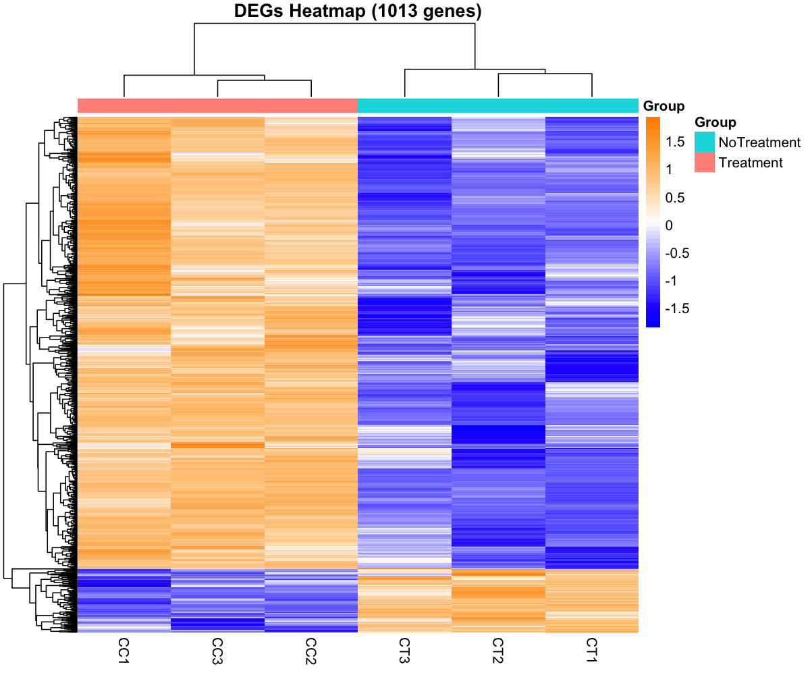
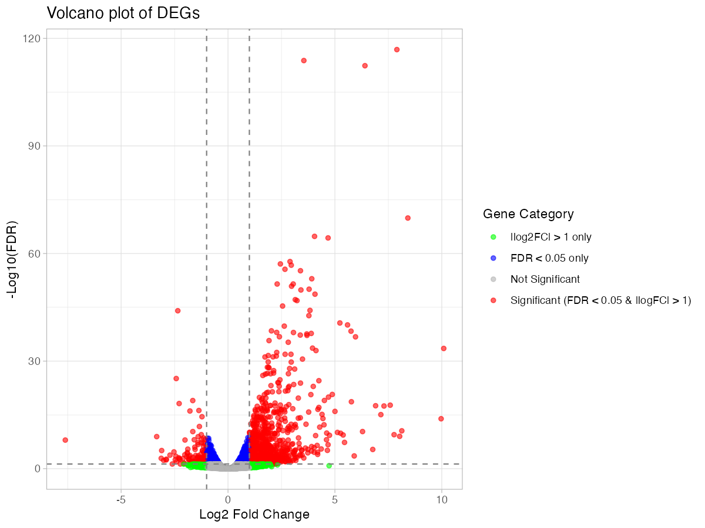
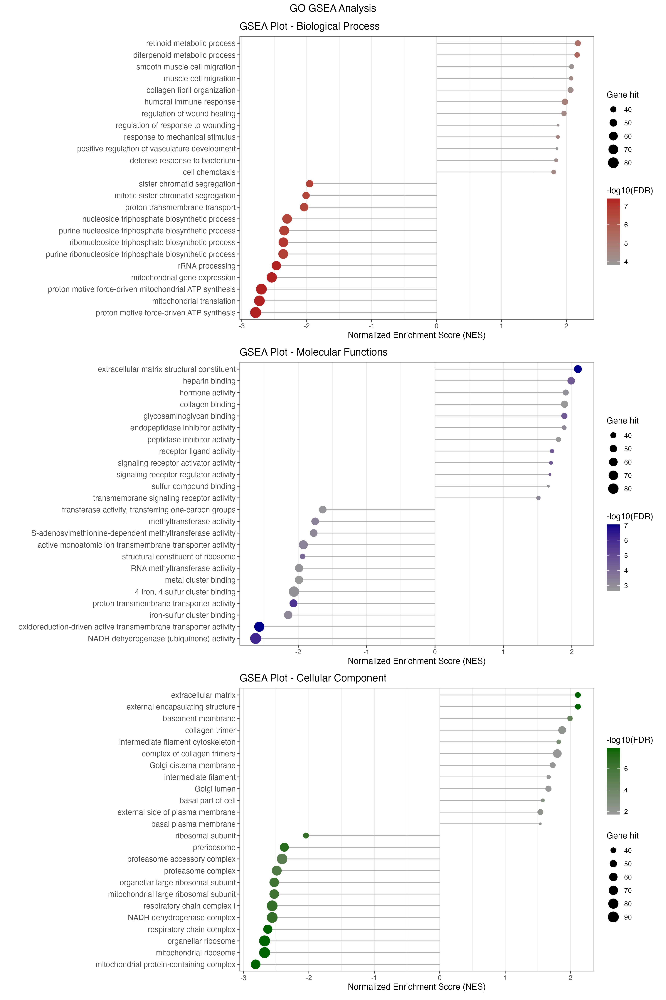
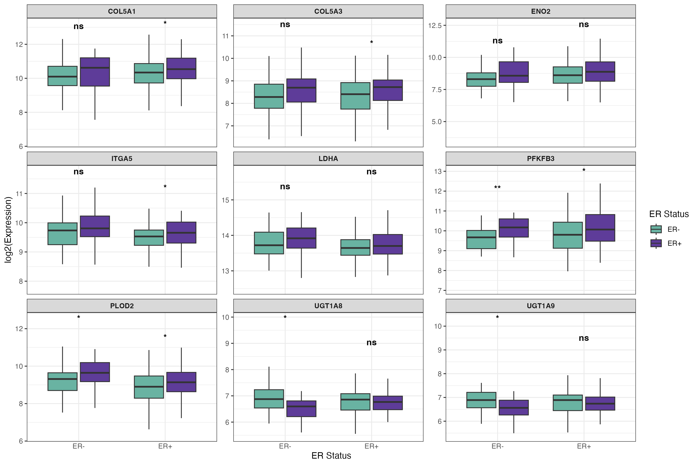

# End-to-End Bulk RNA-seq Analysis Workflow (edgeR) for Differential Expression and Functional Interpretation

   

------------------------------------------------------------------------

# 💼 Bioinformatics Service Demonstration

This repository presents a complete end-to-end Bulk RNA-seq analysis workflow applied to a real biological dataset. It is designed as a reproducible example of standard Bioconductor-based analysis practices in R.

The workflow is structured to be transferable to similar bulk RNA-seq experimental designs.

**Analysis capabilities demonstrated in this project include:**

### Core analyses

-   Differential expression: edgeR (TMM normalization + Exact Test / GLM framework)
-   Functional enrichment analysis (GO, KEGG, Reactome, GSEA)
-   Standard visualization approaches (PCA, heatmaps, volcano plots)
-   Biological interpretation of transcriptomic results

### Extended analyses

-   Weighted Gene Co-expression Network Analysis (WGCNA)
-   Protein–Protein Interaction (PPI) network analysis
-   Hub gene identification and network topology analysis

**📤 Deliverables:**

### Core deliverables

-   Differential expression tables (log2FC, FDR)
-   Functional enrichment results
-   Publication-ready plots

### Extended deliverables

-   Co-expression network modules (WGCNA)
-   PPI network visualizations
-   Hub gene prioritization results

------------------------------------------------------------------------

# 📊 Case Study: Breast Cancer RNA-seq Dataset

This workflow is demonstrated using a publicly available RNA-seq dataset.

-   Model: MCF-7 breast cancer cells
-   Conditions: Control vs ADSC coculture
-   Replicates: 3 vs 3
-   NCBI BioProject: PRJNA1161137

------------------------------------------------------------------------

# 🧬 Biological Context

This analysis is based on the study:

“Integrated RNA Sequencing Analysis Revealed Early Gene Expression Shifts Associated with Cancer Progression in MCF-7 Breast Cancer Cells Cocultured with Adipose-Derived Stem Cells”

The tumor microenvironment (TME), particularly adipose-derived stem cells (ADSCs), plays a crucial role in modulating cancer cell behavior.

Key biological mechanisms investigated:

-   Early transcriptional reprogramming
-   Activation of proliferation and migration pathways
-   ECM remodeling
-   PI3K-Akt and MAPK signaling pathways

------------------------------------------------------------------------

# 📌 Key Results

-   Identification of statistically significant differentially expressed genes (DEGs)\

-   Clear separation of experimental groups observed in PCA analysis\

-   Functional enrichment revealed strong activation of extracellular matrix remodeling, hypoxia response, and metabolic reprogramming pathways\

-   Key pathways involved include PI3K-Akt signaling, MAPK signaling, and HIF-1 signaling\

-   Identification of hub genes associated with tumor microenvironment interactions and growth signaling

------------------------------------------------------------------------

# ⚙️ Analysis Pipeline

## Upstream (Preprocessing)

1.  Data download (SRA)
2.  Quality control: FastQC + MultiQC
3.  Adapter trimming: Trimmomatic
4.  Alignment: HISAT2
5.  Quantification: featureCounts

## Downstream Analysis

### Core RNA-seq analysis

1.  Differential expression: edgeR (TMM + Exact Test / GLM framework)
2.  Functional enrichment: GO, KEGG, Reactome, GSEA
3.  Standard visualization: PCA, heatmaps, volcano plots

### Extended analyses

4.  Weighted gene co-expression network analysis (WGCNA)
5.  Protein–protein interaction (PPI) network analysis
6.  Hub gene identification and network topology analysis
7.  Survival analysis (exploratory module)

------------------------------------------------------------------------

# 📤 Example Output (Client-Oriented)

This section shows the type of results a client would receive.

## 📈 Visual Outputs:

-   **Heatmaps of DEGs**\



-   **Volcano plots with log2FC and FDR**\



-   **Dendrogram of modules from WGCNA**\


-   **GSEA: significant pathways in GO, KEGG, Reactome, Hallmarks**\




-   **PPI network and identification of hub genes**\


-   **Expression of Top Hub Genes Stratified by ER Status and Relapse**\



------------------------------------------------------------------------

### 🧠 Biological Interpretation

Coculture of MCF-7 breast cancer cells with adipose-derived stem cells (ADSCs) induces a coordinated transcriptional reprogramming involving extracellular matrix remodeling, metabolic adaptation, and activation of pro-growth signaling pathways.

A strong enrichment of extracellular matrix (ECM) organization, integrin signaling, and focal adhesion pathways suggests a dynamic remodeling of the tumor microenvironment, potentially facilitating increased cell adhesion, migration, and invasiveness.

In parallel, hypoxia-related responses and metabolic pathway reprogramming (including glycolysis and central carbon metabolism in cancer) indicate a shift toward a more glycolytic and stress-adapted cellular state, consistent with early tumor progression mechanisms.

Moreover, activation of cytokine signaling, JAK-STAT pathways, and immune-related processes highlights a complex interplay between tumor cells and stromal components, suggesting that ADSCs contribute to a pro-inflammatory and tumor-supportive microenvironment.

Finally, enrichment of growth factor signaling and FOXO-mediated transcriptional regulation indicates enhanced proliferative signaling and survival advantage in cancer cells.

Overall, these findings suggest that stromal–tumor interactions mediated by ADSCs may promote a pro-tumorigenic transcriptional state in MCF-7 cells.

------------------------------------------------------------------------

# Experimental Design

The experiment consists of **6 RNA-seq samples**, with 3 biological replicates per condition:

| Condition | Number of Replicates | Description                       |
|-----------|----------------------|-----------------------------------|
| Control   | 3                    | MCF-7 cells cultured alone        |
| Treatment | 3                    | MCF-7 cells cocultured with ADSCs |

------------------------------------------------------------------------

# 📁 Project Structure

``` text
Bulk-RNA-Seq-pipeline(edgeR)/
├── README.Rmd
├── README.md
├── reports/
│   ├── REPORT.Rmd
│   ├── REPORT.md
│   ├── REPORT.html
│   ├── REPORT.pdf
├── upstream/
│   ├── report/
│   │   ├── featureCounts/
│   │   ├── MultiQC/
│   │   └── Trimmomatic/
│   └── script
│
├── downstream/
│   ├── Cytoscape/
│   │   ├── common_genes_STRING.txt
│   │   ├── Hub_genes.png
│   │   ├── MCC_Value.csv
│   │   ├── MCC_ValueClean.csv
│   │   ├── PPI_Network.cys
│   │   ├── string_interactions_short.tsv
│   ├── objects/
│   │   ├── Background_genes.rds
│   │   ├── CommonGenes.rds
│   │   ├── ExactTestDEG.rds
│   │   ├── genes_ME_brown.rds
│   │   ├── logCPM_counts.rds
│   │   ├── ResFromExactTest.rds
│   ├── R-scripts/
│   │   ├── 01-ExactTest.R
│   │   ├── 02-WGCNA.R
│   │   ├── 03-ORA.R
│   │   ├── 04-GSEA.R
│   │   ├── 05-PPI.R
│   │   └── 06-Disease-Free-SurvivalAnalysis.R
│   └── plots/
│       ├── ExactTest/
│       ├── GSEA/
│       ├── ORA/
│       ├── PPI/
│       ├── Survival/
│       ├── WGCNA/
```

------------------------------------------------------------------------

# 🔁 Reproducibility

All analyses are reproducible:

-   Scripts are modular and sequential
-   R session information and package versions are documented
-   Package versions are documented
-   Recommended: use `renv` to recreate the R environment

Due to file size limitations, the full count matrix is not included in this repository. A processed and analysis-ready version of the dataset is available upon request.

## 📊 Reproducibility Note

All analyses follow widely adopted Bioconductor workflows for RNA-seq differential expression analysis in R.

## 📄 Conclusions

-   Successful replication of published results
-   Identification of key genes and pathways
-   Demonstration of a complete RNA-seq workflow

------------------------------------------------------------------------

# References

1.  **Original paper:** Integrated RNA Sequencing Analysis Revealed Early Gene Expression Shifts Associated with Cancer Progression in MCF-7 Breast Cancer Cells Cocultured with Adipose-Derived Stem Cells, *Curr. Issues Mol. Biol.*, 2023, DOI: [10.3390/cimb46110702](https://doi.org/10.3390/cimb46110702)\
2.  **GEO dataset:** [GSE2034](https://www.ncbi.nlm.nih.gov/geo/query/acc.cgi?acc=GSE2034)\
3.  **BioProject:** [PRJNA1161137](https://www.ncbi.nlm.nih.gov/bioproject/PRJNA1161137)\
4.  **RNA-seq best practices:** [Bioconductor RNA-seq workflow](https://www.bioconductor.org/help/workflows/rnaseqGene/)

# Tools

1.  **R** (v.4.5.1)
2.  **Bioconductor / CRAN packages:** edgeR (v4.8.2), WGCNA (v1.74), clusterProfiler (v4.18.4), ReactomePA (v1.54.0), fgsea (v1.36.2)
3.  **PPI tools:**
    -   STRING v12.0: protein–protein interaction database
    -   Cytoscape v3.10.4: network visualization platform
    -   cytoHubba plugin: hub gene identification (MCC algorithm)
4.  **Additional tools**:
    -   HISAT2 (alignment)
    -   featureCounts (quantification)
    -   FastQC / MultiQC (quality control)
    -   Trimmomatic (remove adapters)

------------------------------------------------------------------------

# 📬 Contact

This project is part of a bioinformatics portfolio focused on end-to-end RNA-seq data analysis services for research and translational applications.

I am available for freelance bioinformatics projects, including:

-   End-to-end Bulk RNA-seq analysis (from raw counts to biological interpretation)
-   Differential expression analysis (edgeR pipelines)
-   Functional enrichment (GO, KEGG, Reactome)
-   Gene Set Enrichment Analysis (GSEA, including MSigDB Hallmark gene sets)
-   Weighted Gene Co-expression Network Analysis (WGCNA)
-   Data visualization and publication-ready figures
-   Reproducible and well-documented analysis pipelines

💡 If you have RNA-seq data and need:

-   reliable differential expression results\
-   pathway and gene set-level interpretation (including Hallmarks)\
-   network-based insights (WGCNA modules and hub genes)\
-   professional figures for publication or reports

I can help translate your data into actionable insights.

🚀 Available for short-term and long-term collaborations.

📩 Get in touch:

-   GitHub: [github.com/DaviMacca08](https://github.com/DaviMacca08)
-   Email: [davide_maccarrone\@icloud.com](mailto:davide_maccarrone@icloud.com){.email}
