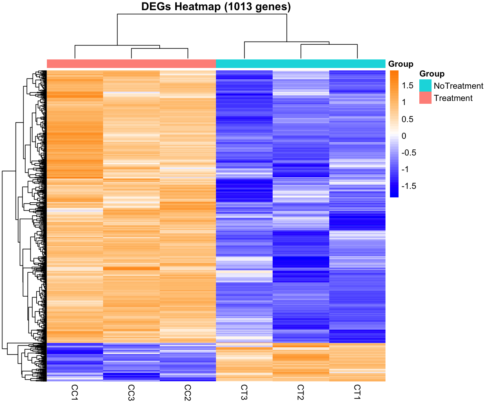
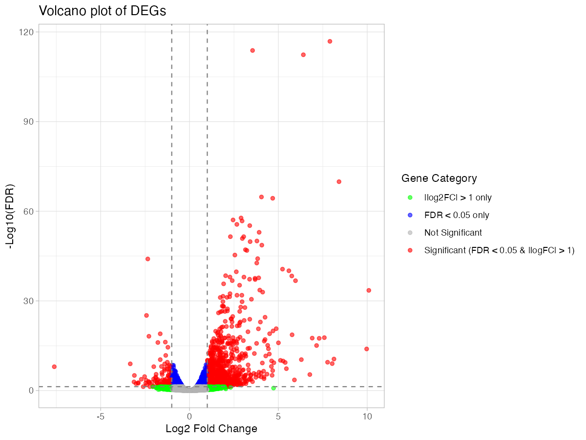
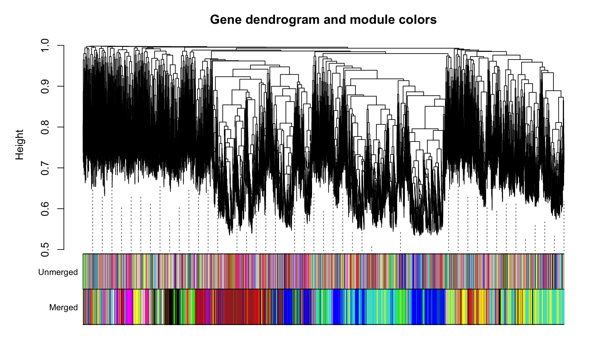
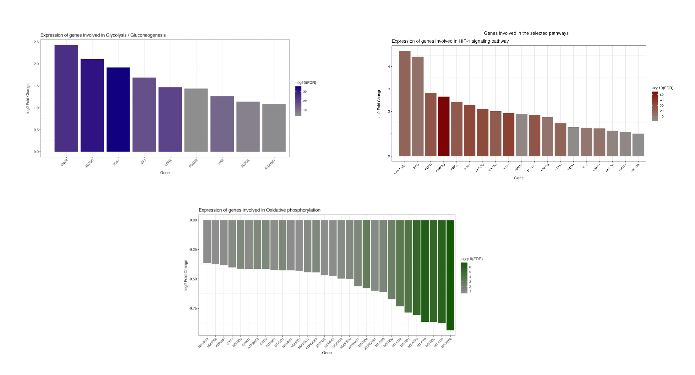
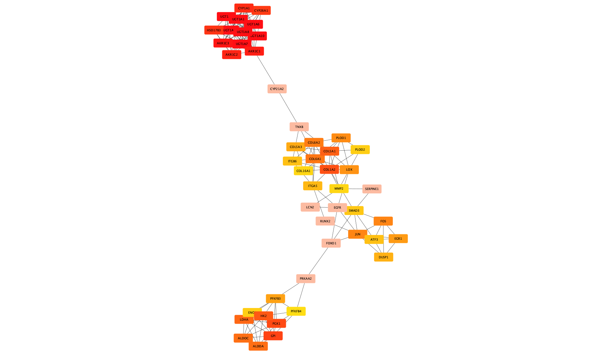
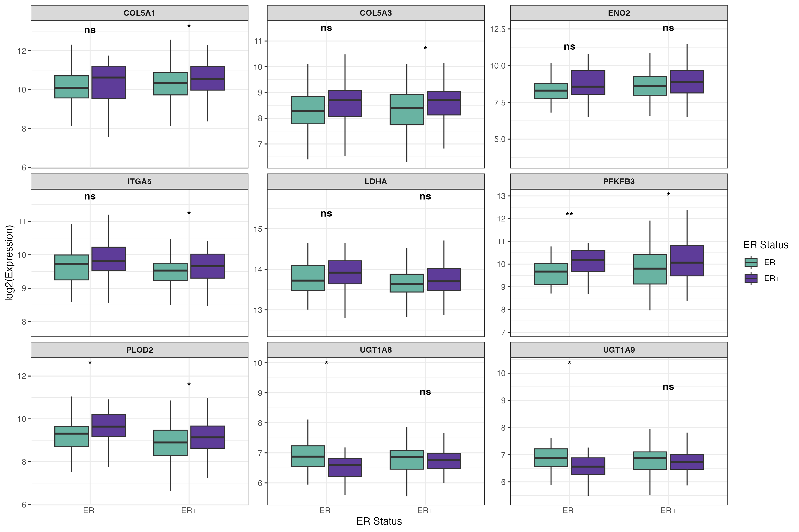
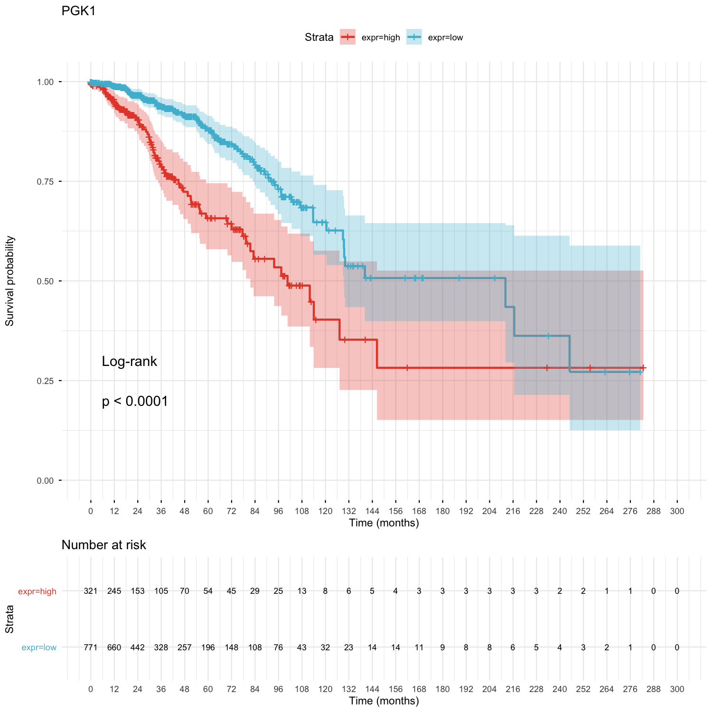

# End-to-End Bulk RNA-seq Analysis Workflow (edgeR) for Differential Expression and Functional Interpretation

   

------------------------------------------------------------------------

# 💼 Bioinformatics Service Demonstration

This repository presents a complete end-to-end Bulk RNA-seq analysis workflow applied to a real biological dataset. It is designed as a reproducible example of standard Bioconductor-based analysis practices in R.

The workflow is structured to be transferable to similar bulk RNA-seq experimental designs.

**Analysis capabilities demonstrated in this project include:**

### Core analyses

-   Differential expression: edgeR (TMM normalization + Exact Test / GLM framework)
-   Functional enrichment analysis (GO, KEGG, Reactome)
-   Gene Set Enrichment Analysis (GSEA)
-   Standard visualization approaches (PCA, heatmaps, volcano plots)
-   Biological interpretation of transcriptomic results

### Extended analyses

-   Weighted Gene Co-expression Network Analysis (WGCNA)
-   Protein–Protein Interaction (PPI) network analysis
-   Hub gene identification and network topology analysis

### Translational and clinical analyses

-   Disease-Free Survival analysis on independent GEO breast cancer cohorts
-   Overall Survival analysis using TCGA-BRCA clinical data
-   Kaplan–Meier survival analysis and log-rank testing
-   Prognostic assessment of candidate hub genes

**📤 Deliverables:**

### Core deliverables

-   Differential expression tables (log2FC, FDR)
-   Over-representation analysis (ORA) results (GO / KEGG / Reactome)
-   Gene Set Enrichment Analysis (GSEA) results (rank-based enrichment)
-   Publication-ready plots

### Extended deliverables

-   Co-expression network modules (WGCNA)
-   PPI network visualizations
-   Hub gene prioritization results and network topology analysis
-   Kaplan–Meier survival curves and prognostic stratification analyses
-   Disease-Free Survival and Overall Survival association results
-   Candidate prognostic biomarker identification

------------------------------------------------------------------------

# 📊 Case Study: Breast Cancer RNA-seq Dataset

This workflow is demonstrated using a publicly available RNA-seq dataset.

-   Model: MCF-7 breast cancer cells
-   Conditions: Control vs ADSC coculture
-   Replicates: 3 vs 3
-   NCBI BioProject: PRJNA1161137

------------------------------------------------------------------------

# 🧬 Biological Context

This analysis is based on the study:

“Integrated RNA Sequencing Analysis Revealed Early Gene Expression Shifts Associated with Cancer Progression in MCF-7 Breast Cancer Cells Cocultured with Adipose-Derived Stem Cells”

The tumor microenvironment (TME), particularly adipose-derived stem cells (ADSCs), plays a crucial role in modulating cancer cell behavior.

Key biological mechanisms investigated:

-   Early transcriptional reprogramming
-   Activation of proliferation and migration pathways
-   ECM remodeling
-   PI3K-Akt and MAPK signaling pathways

------------------------------------------------------------------------

# 📌 Key Results

-   Identification of statistically significant differentially expressed genes (DEGs) associated with breast cancer progression\

-   Clear transcriptomic separation between experimental groups observed through Principal Component Analysis (PCA)\

-   Over-representation analysis (ORA) revealed activation of extracellular matrix remodeling, hypoxia response, metabolic reprogramming, and tumor microenvironment-related pathways\

-   Gene Set Enrichment Analysis (GSEA) confirmed coordinated enrichment of key biological programs, including HIF-1 signaling, glycolysis/gluconeogenesis, and oxidative phosphorylation, indicating systemic metabolic reprogramming in breast cancer cells\

-   Network-based analyses identified biologically relevant hub genes involved in tumor progression and cellular communication\

-   Disease-Free Survival analysis using the independent GEO cohort GSE2034 identified relapse-associated hub genes linked to breast cancer recurrence\

-   Overall Survival analysis using TCGA-BRCA RNA-seq and clinical data revealed survival-associated candidate prognostic biomarker\

-   Multivariate Cox proportional hazards modeling suggested that selected hub genes retained prognostic relevance after adjustment for clinical covariates

------------------------------------------------------------------------

# ⚙️ Analysis Pipeline

## Upstream (Preprocessing)

1.  Data download (SRA)
2.  Quality control: FastQC + MultiQC
3.  Adapter trimming: Trimmomatic
4.  Alignment: HISAT2
5.  Quantification: featureCounts

## Downstream Analysis

### Transcriptomic profiling

1.  Differential expression analysis using edgeR (TMM normalization with generalized linear modeling framework)
2.  Functional enrichment analysis: Over-representation analysis (Gene Ontology, KEGG, Reactome) and Gene Set Enrichment Analysis (GSEA) for pathway-level interpretation
3.  Exploratory data visualization (PCA, hierarchical clustering, heatmaps, volcano plots)

### Systems biology and network analysis

4.  Weighted Gene Co-expression Network Analysis (WGCNA) for module detection and gene clustering
5.  Protein–Protein Interaction (PPI) network construction and visualization
6.  Network topology analysis and hub gene prioritization using centrality-based metrics

### Translational and clinical validation

7.  Survival analysis for clinical relevance assessment:
    -   Disease-Free Survival analysis using independent GEO cohort
    -   Overall Survival analysis using TCGA-BRCA clinical data
    -   Kaplan–Meier survival modeling and Cox proportional hazards regression

------------------------------------------------------------------------

# 📤 Example Output (Client-Oriented)

This section shows the type of results a client would receive.

## 📈 Visual Outputs:

-   **Heatmaps of DEGs**\



-   **Volcano plots with log2FC and FDR**\



-   **Dendrogram of modules from WGCNA**\



-   **GO Over-Representation Analysis (ORA): significant Biological Process (BP), Molecular Function (MF), and Cellular Component (CC) terms**\


-   **GSEA: top contributing genes in HIF-1 signaling, glycolysis/gluconeogenesis, and oxidative phosphorylation pathways**



-   **PPI network and identification of hub genes**\



-   **Expression of Top Hub Genes Stratified by ER Status and Relapse**\



-   **Kaplan–Meier overall survival stratification based on PGK1 expression levels**



------------------------------------------------------------------------

### 🧠 Biological Interpretation

Coculture of MCF-7 breast cancer cells with adipose-derived stem cells (ADSCs) induces a coordinated transcriptional reprogramming involving extracellular matrix remodeling, metabolic adaptation, and activation of pro-growth signaling pathways.

A strong enrichment of extracellular matrix (ECM) organization, integrin signaling, and focal adhesion pathways suggests a dynamic remodeling of the tumor microenvironment, potentially facilitating increased cell adhesion, migration, and invasiveness.

In parallel, hypoxia-related responses and metabolic pathway reprogramming (including glycolysis and central carbon metabolism in cancer) indicate a shift toward a more glycolytic and stress-adapted cellular state, consistent with early tumor progression mechanisms.

Moreover, activation of cytokine signaling, JAK-STAT pathways, and immune-related processes highlights a complex interplay between tumor cells and stromal components, suggesting that ADSCs contribute to a pro-inflammatory and tumor-supportive microenvironment.

Finally, enrichment of growth factor signaling and FOXO-mediated transcriptional regulation indicates enhanced proliferative signaling and survival advantage in cancer cells.

These transcriptional programs are consistent with survival-associated molecular signatures observed in breast cancer, where genes involved in extracellular matrix remodeling, metabolic reprogramming, and pro-growth signaling have been linked to both disease recurrence and reduced overall survival in independent patient cohorts.

Overall, these findings suggest that stromal–tumor interactions mediated by ADSCs may promote a pro-tumorigenic transcriptional state in MCF-7 cells.

------------------------------------------------------------------------

# Experimental Design

The experiment consists of **6 RNA-seq samples**, with 3 biological replicates per condition:

| Condition | Number of Replicates | Description                       |
|-----------|----------------------|-----------------------------------|
| Control   | 3                    | MCF-7 cells cultured alone        |
| Treatment | 3                    | MCF-7 cells cocultured with ADSCs |

------------------------------------------------------------------------

# 📁 Project Structure

``` text
Bulk-RNA-Seq-pipeline(edgeR)/
├── README.Rmd
├── README.md
├── reports/
│   ├── REPORT.Rmd
│   ├── REPORT.md
│   ├── REPORT.html
├── upstream/
│   ├── report/
│   │   ├── featureCounts/
│   │   ├── MultiQC/
│   │   └── Trimmomatic/
│   └── script
│
├── downstream/
│   ├── Cytoscape/
│   │   ├── common_genes_STRING.txt
│   │   ├── Hub_genes.png
│   │   ├── MCC_Value.csv
│   │   ├── MCC_ValueClean.csv
│   │   ├── PPI_Network.cys
│   │   ├── string_interactions_short.tsv
│   ├── R-scripts/
│   │   ├── 01-ExactTest.R
│   │   ├── 02-WGCNA.R
│   │   ├── 03-ORA.R
│   │   ├── 04-GSEA.R
│   │   ├── 05-PPI.R
│   │   ├── 06-Disease-Free-SurvivalAnalysis.R
│   │   └── 07-Overall_SurvivalAnalysis.R
│   └── plots/
│       ├── ExactTest/
│       ├── GSEA/
│       ├── ORA/
│       ├── PPI/
│       ├── Disease-Free_Survival/
│       ├── Overall_Survival/
│       ├── WGCNA/
```

------------------------------------------------------------------------

# 🔁 Reproducibility

All analyses are reproducible:

-   Scripts are modular and sequential
-   R session information and package versions are documented
-   Package versions are documented
-   Recommended: use `renv` to recreate the R environment

Due to file size limitations, the full count matrix is not included in this repository. A processed and analysis-ready version of the dataset is available upon request.

## 📊 Reproducibility Note

All analyses follow widely adopted Bioconductor workflows for RNA-seq differential expression analysis in R.

## 📄 Conclusions

-   Successful replication of published results
-   Identification of key genes and pathways
-   Demonstration of a complete RNA-seq workflow

------------------------------------------------------------------------

# References

1.  **Original paper:** Integrated RNA Sequencing Analysis Revealed Early Gene Expression Shifts Associated with Cancer Progression in MCF-7 Breast Cancer Cells Cocultured with Adipose-Derived Stem Cells, *Curr. Issues Mol. Biol.*, 2023, DOI: [10.3390/cimb46110702](https://doi.org/10.3390/cimb46110702)\
2.  **GEO dataset:** [GSE2034](https://www.ncbi.nlm.nih.gov/geo/query/acc.cgi?acc=GSE2034)\
3.  **TCGA-BRCA dataset:** The Cancer Genome Atlas Breast Cancer cohort (TCGA-BRCA), accessed via the National Cancer Institute GDC Portal – <https://www.cancer.gov/ccg/research/genome-sequencing/tcga> (accessed on 10 May 2026)\
4.  **BioProject:** [PRJNA1161137](https://www.ncbi.nlm.nih.gov/bioproject/PRJNA1161137)\
5.  **RNA-seq best practices:** [Bioconductor RNA-seq workflow](https://www.bioconductor.org/help/workflows/rnaseqGene/)

# Tools

1.  **R** (v.4.5.1)
2.  **Bioconductor / CRAN packages:** edgeR (v4.8.2), WGCNA (v1.74), clusterProfiler (v4.18.4), ReactomePA (v1.54.0), fgsea (v1.36.2), survival (v3.8.6), survminer (v0.5.2)
3.  **PPI tools:**
    -   STRING v12.0: protein–protein interaction database
    -   Cytoscape v3.10.4: network visualization platform
    -   cytoHubba plugin: hub gene identification (MCC algorithm)
4.  **Additional tools**:
    -   HISAT2 (alignment)
    -   featureCounts (quantification)
    -   FastQC / MultiQC (quality control)
    -   Trimmomatic (remove adapters)

------------------------------------------------------------------------

# 📬 Contact

This project is part of a bioinformatics portfolio focused on end-to-end RNA-seq data analysis services for research and translational applications.

I am available for freelance bioinformatics projects, including:

-   End-to-end Bulk RNA-seq analysis (from raw counts to biological interpretation)
-   Differential expression analysis (edgeR pipelines)
-   Functional enrichment (GO, KEGG, Reactome)
-   Gene Set Enrichment Analysis (GSEA, including MSigDB Hallmark gene sets)
-   Weighted Gene Co-expression Network Analysis (WGCNA)
-   Data visualization and publication-ready figures
-   Reproducible and well-documented analysis pipelines

💡 If you have RNA-seq data and need:

-   reliable differential expression results\
-   pathway and gene set-level interpretation (including Hallmarks)\
-   network-based insights (WGCNA modules and hub genes)\
-   professional figures for publication or reports

I can help translate your data into actionable insights.

🚀 Available for short-term and long-term collaborations.

📩 Get in touch:

-   GitHub: [github.com/DaviMacca08](https://github.com/DaviMacca08)
-   Email: [davide_maccarrone\@icloud.com](mailto:davide_maccarrone@icloud.com){.email}
